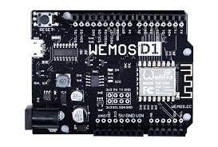
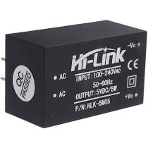
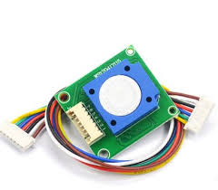
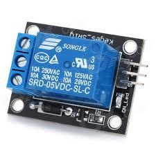
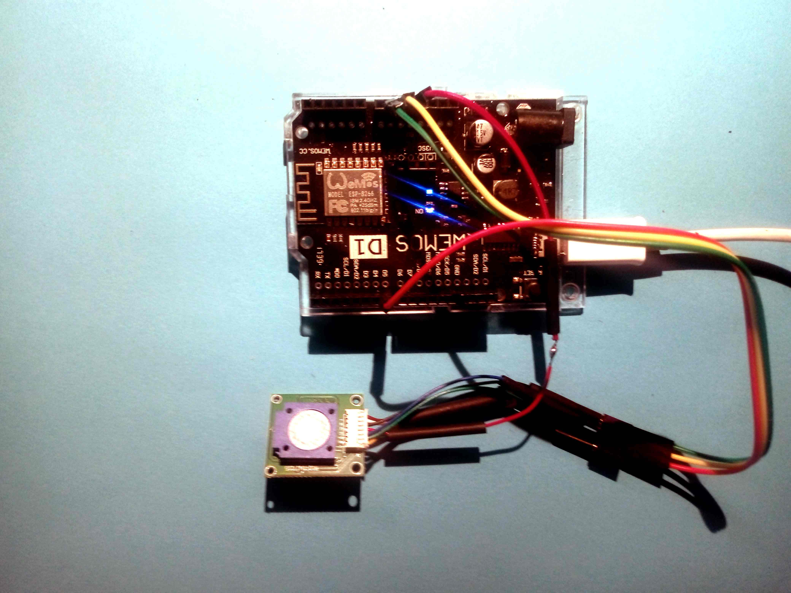

# ozoneMaster

Utilizzando componenti allo stato dell’arte è possibile realizzare un regolatore on-off per Ozono, Il progetto non è semplicissimo, perchè utilizza diversi componenti, ma per questo progetto non è possibile usare Sonoff.

Scheda base WEIMOS D1 R2 (eps8266 WiFi), Alimentatore 5V HiLink: 

 

WEIMOS schematics: [https://www.openhacks.com/uploadsproductos/wemos-d1-r2-schematic.pdf](https://www.openhacks.com/uploadsproductos/wemos-d1-r2-schematic.pdf)

sensore per ozono con CPU ZE25-O3 e relay KEYES

 

ozone sensor [https://www.winsen-sensor.com/sensors/o3-gas-sensor/ze25-o3.html](https://www.winsen-sensor.com/sensors/o3-gas-sensor/ze25-o3.html)

-------
Prove HW:

## stato

- HW: test
- SW: sviluppo
