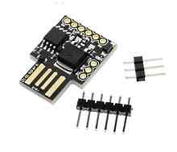

#ozoneMeter#

Semplice misuratore di Ozono, indica la presenza di concentrazioni di Ozono sicure o pericolose con 5 LED colorati:

<table><tr><td>

</td><td><ul>
<li>Sono utilizzati dei LED per indicare alcuni livelli di Ozono presente nell’ambiente: <b>40 ppb, 60 ppb, 200 ppb, 1000 ppb.</b>  
<li>La compensazione di umidità e temperatura è ottenuta con una calibrazione sul livello del fondo atmosferico.
</ul></td><tr></table>

## Componenti: ##

**Digispark (cpu ATTINY85) Board**

**Sensor Board (MQ135-03)**

##Stato##

- WH: test circuito
- SW: vers. 1 debug

      