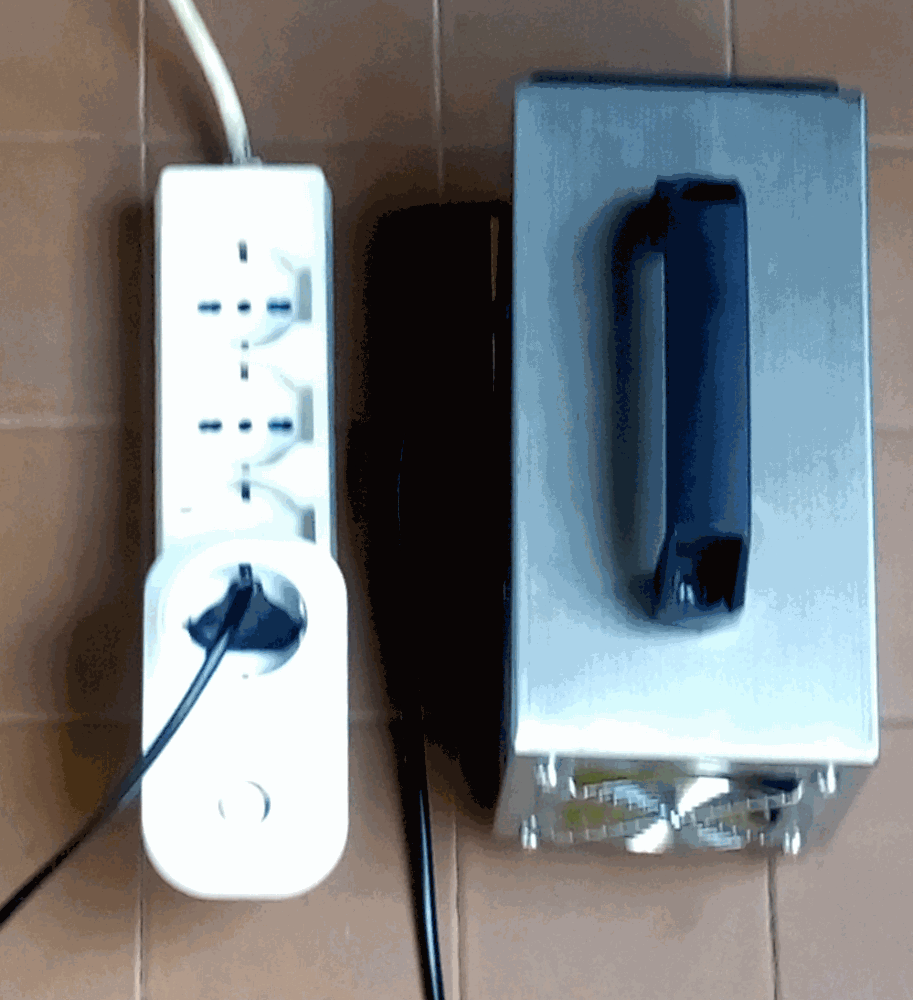
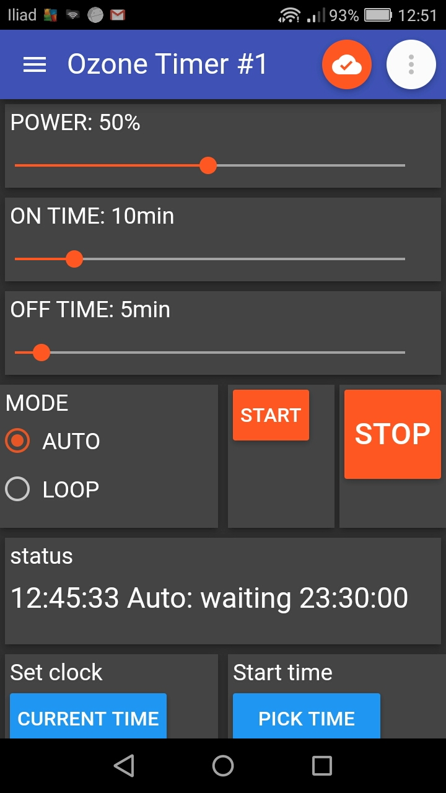
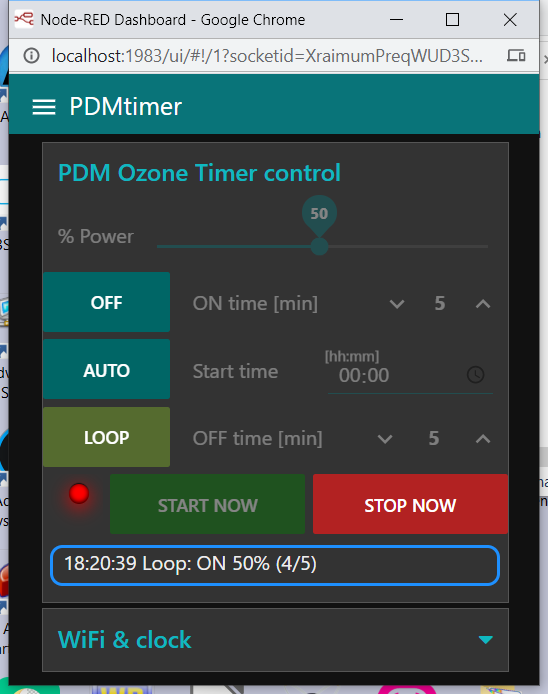
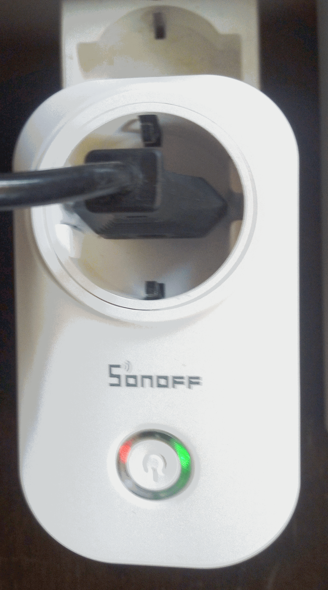

# Ozone PDM timer
 

A timer specially designed to control Ozone generators without a timer or the PDM function.

1. PDM (Pulse Duration Modulation) function
2. timed start
3. single (chock) or cyclic (air purify) ozonation
4. remote control and settings with smartphone or PC
5. delayed start button

 
This **timerPDM** is autonomous, but at the same time compatible with external standard MQTT clients and brokers: therefore it can be used standalone or remotely controlled or even integrated into more complex projects, of home automation and smart homes.

Included applications:

- **timerPDM-red** for PC, (uses *node-red*)
- **PDM timer** for Android, (uses *IoT MQTT Panel*)

English version, see file: [timerPDM_sonoff_en.pdf](timerPDM_sonoff_en)

Last version: https://github.com/msillano/Ozone-coronavirus-sonoff/tree/master/PROJECTS-DIY/timerPDM

------------
# timerPDM
Un timer progettato appositamente per il comando dei generatori di Ozono privi di timer o di funzione PDM.

1. funzione PDM (Pulse Duration Modulation)
2. avvio ad orario 
3. ozonizzazione singola (chock) o ciclica (air purify)
4. telecomando ed impostazioni con smartphone o PC
5. pulsante di avvio ritardato

 
Questo **timerPDM**  è autonomo, ma nel contempo compatibile con client e broker MQTT standard esterni: pertanto può essere usato standalone o essere controllato da remoto o anche essere integrato in progetti più complessi, di domotica e case intelligenti.

Applicazioni incluse:

- **timerPDM-red** per PC, (usa *node-red*)
- **PDM timer** per Android, (usa *IoT MQTT Panel*)

Versione Italiana, vedi file: *timerPDM_sonoff_it.pdf*

Ultima versione: https://github.com/msillano/Ozone-coronavirus-sonoff/tree/master/PROJECTS-DIY/timerPDM

---------------------------------
  
