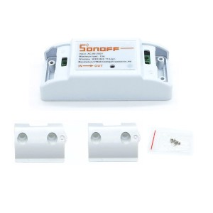
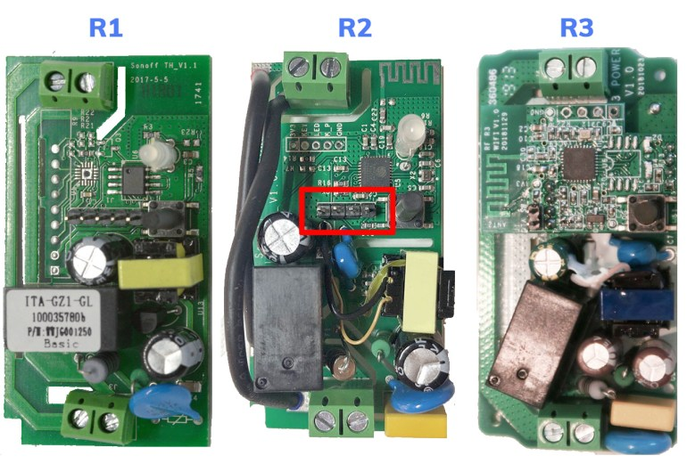
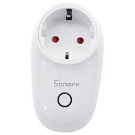
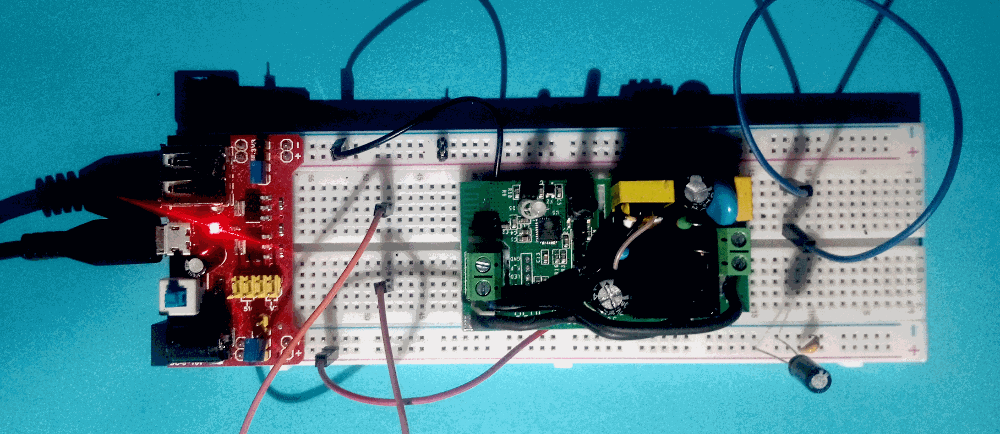

# timerPDM
Un semplice timer, con funzione PDM, progettato appositamente per il comando dei generatori di Ozono privi di timer o di funzione PDM.

Molto economico e perfor­mante, può essere comandato da un PC o da un smartphone, in tutta sicurezza. 

Sviluppato utilizzando **Sonoff basic** (versioni R1, R2, R3):

------
Sto attendendo l'arrivo di **Sonoff wall switch** (vari tipi di spina-presa), che ha una migliore forma per un timer. (ma è più caro: 11€ contro 5€)

 
## stato

SW: in sviluppo
